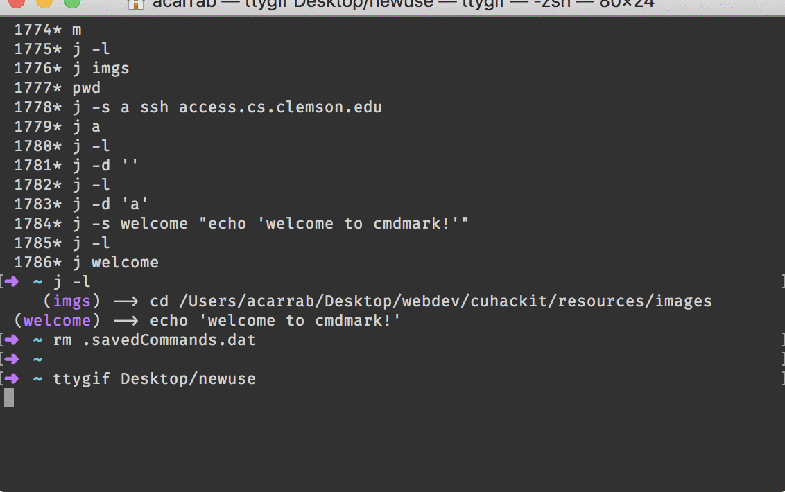
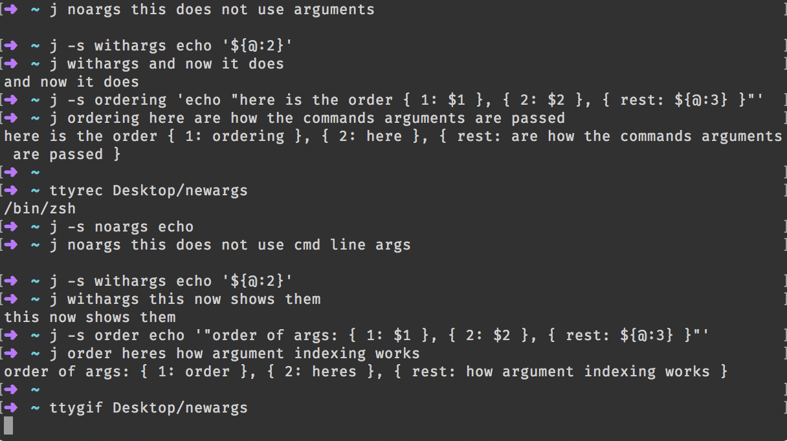

# Command Mark

- *New Feature* You can now use Tab completion to finish commands
- *NOTE* gifs are out of date...


Mark commands and locations in bash easily.
The commands are saved where you specify when installing

The script is written in bash, so it should be compatible with most linux/macOS systems.





## Installation

download the file and go to the directory
```bash
git clone https://github.com/acarrab/cmdmark.git
cd cmdmark
```
### Run the install


Note: This writes two commands to your .bashrc `j` and `m`, but it
also deletes any previously defined commands with those names. You may
also specify a different init file by just passing it as a command
line argument.

```bash
[cmdmark] acarrab$ ./install.sh
```

Or with the command line argument
```bash
[cmdmark] acarrab$ ./install.sh ~/.bash_profile
```
## Command line arguments




## Functionality through flag

### `-help`
List the possible commands

```bash
user$ j -help
commands:
   set:    -set <name> <command>
   delete: -delete <name>
   list:   -list
   help:   -help
```

### `-set`
Set command


Examples:

This sets the command `ssh server.place.edu` to the name `server`
```bash
$ j -set server ssh server.place.edu
```
then if you type
```bash
$ j server
```
it will ssh to that server


You can also set a default command to run when you type just `j`
```bash
$ j -set '' echo I am the default command\!
$ j
I am the default command!
```

### `-list`
Lists the possible commands

Here is an example of what mine kind of looks like

```bash
acarrab$ j -list
          () --> cd /Users/acarrab/bashtools/cmdmark
         (a) --> ssh access.cs.server.edu
         (k) --> ssh -t access.cs.server.edu ssh acarrab@koala3.cs.server.edu
         (p) --> /Users/acarrab/bashTools/login.sh
        (at) --> sftp acarrab@access.cs.server.edu
        (cd) --> /Users/acarrab/bashtools/cmdmark
        (pc) --> /Users/acarrab/bashtools/login.sh campus
        (pt) --> /Users/acarrab/bashtools/login.sh transfer
       (zsh) --> chsh -s /bin/zsh
      (auto) --> ssh -t access.cs.server.edu ssh compe@130.127.113.1
      (bash) --> chsh -s /bin/bash
    (george) --> ssh -t access.cs.server.edu ssh compe@130.127.110.103
    (webapp) --> ssh webapp.cs.server.edu
    (webdev) --> cd /Users/acarrab/Desktop/webdev
 (transcode) --> ssh -t access.server.edu ssh other
```

### `-delete`
Deletes the command

Example:
```bash
acarrab$ j -list
   () --> cd /Users/acarrab/bashtools/cmdmark
  (a) --> ssh access.cs.server.edu
  (k) --> ssh -t access.cs.server.edu ssh acarrab@koala3.cs.server.edu
  (p) --> /Users/acarrab/bashTools/login.sh
acarrab$ j -delete
acarrab$ j -list
  (a) --> ssh access.cs.server.edu
  (k) --> ssh -t access.cs.server.edu ssh acarrab@koala3.cs.server.edu
  (p) --> /Users/acarrab/bashTools/login.sh
acarrab$ j -delete k
acarrab$ j -list
  (a) --> ssh access.cs.server.edu
  (p) --> /Users/acarrab/bashTools/login.sh
```


## Specifying different location for save file

This script requires you to have a file in which the commands are saved.
The default save location is set to `~/.savedCommands.dat`, but you can specify
where to install like so

```bash
	./install.sh ~/Desktop/.not_default_location.dat
```
